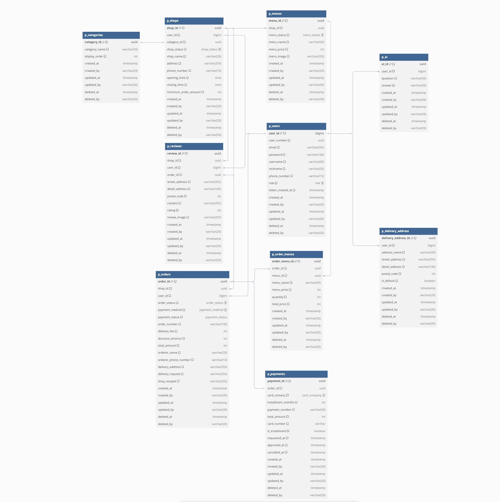
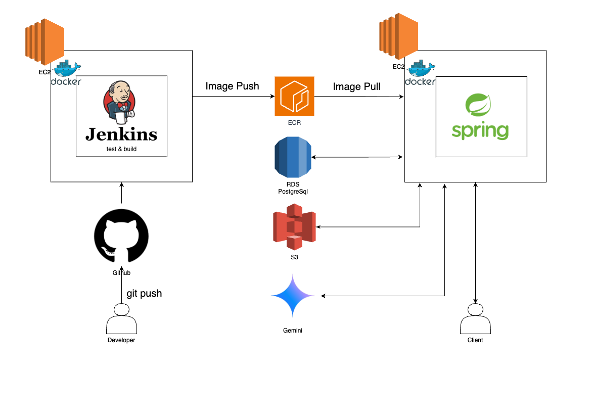

# deliver-foodie
🍜 배달 및 포장 음식 주문 관리 플랫폼 프로젝트

### 프로젝트 개요
> **음식 배달 플랫폼 "Deliver Foodie"**  
> 사장님과 고객을 연결하는 배달 서비스 플랫폼으로, 편리한 주문과 효율적인 가게 관리를 제공합니다.
> 개발 기간: 2024.11.06 ~ 2024.11.18 (2주)

## 👥 팀원 소개 및 역할 분담

| 이름 | 포지션 | 담당 기능 | GitHub |
|------|--------|-----------|---------|
| 손예지 | Team Leader | • 회원 인증/인가 시스템 구현 • 회원 /권한 관리 • API 문서화 • 프로젝트 일정 관리 및 조율 | [@github](https://github.com/handyejee) |
| 신영한 | Sub Leader | • 주문 시스템 구현 • 리뷰 기능 개발 • ERD 설계 및 데이터베이스 모델링  | [@github](https://github.com/syhan7516) |
| 손동필 | Infra Leader | • 가게/메뉴 관리 시스템 구현 • Gemini AI 챗봇 서비스 연동 • AWS 인프라 설계 및 구축 | [@github](https://github.com/sdongpil) |

### 서비스 구성 및 실행방법

### 주요 기능
1. **회원 관리**
   - 역할 기반 권한 관리 (고객/사장님/관리자)
   - JWT 기반 인증/인가

2. **가게 관리**
   - 메뉴 등록/수정 (이미지 업로드)

3. **메뉴 관리**

   
4. **주문 관리**
   - 실시간 주문 상태 확인

5. **AI 기반 사장님 설명 등록**
   - Gemini AI 활용 가게 정보 추천
   - 자동 응답 시스템

### ERD

### 기술 스택

  <h3>Backend</h3>
  
  
  
  <h3>Database</h3>
  
  <h3>Infrastructure</h3>
  
  
  <h3>Development Tools</h3>
  
  

### 인프라 설계도

### API docs

### 진행 일정 및 상세 정보 확인하기
[3NFJ 팀 시트](https://docs.google.com/spreadsheets/d/1yKGRcgBnM2Gkw5XtqhH6qAzK9ZK9LEC4cRE_j-BvcyE/edit?gid=0#gid=0)

- 팀원 역할분담
- 서비스 구성 및 실행방법
- 프로젝트 목적/상세
- ERD
- 기술 스택
- (선택)API docs
